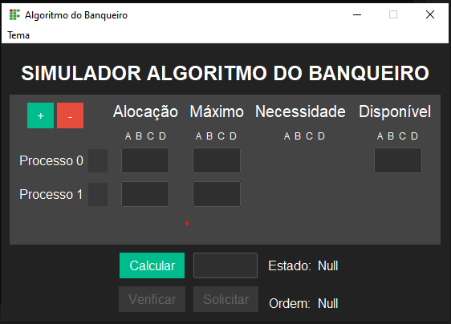
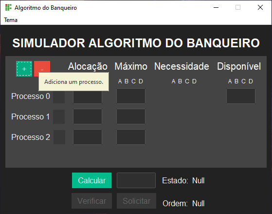
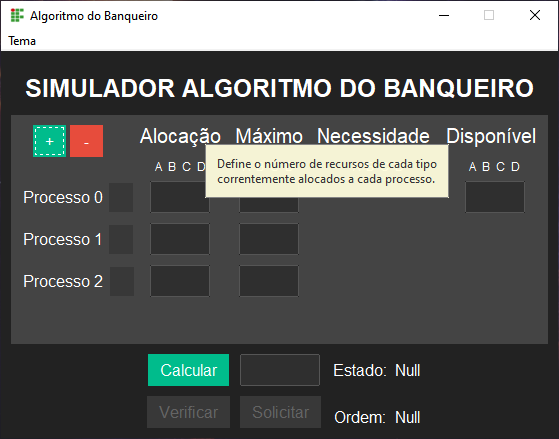

# algoritmo_do_banqueiro_tkinter
Simulador de Algoritmo do Banqueiro para verificação de Deadlocks feita em PYTHON + TKINTER

Esse projeto nasceu como um desafio do professor da disciplina de Sistemas Operacionais do curso de Licenciatura em Computação no IFBA - Campus Porto Seguro. O desafio consistia no desenvolvimento de uma interface gráfica que permitisse o usuário simular as situações de deadlocks aplicando o Algoritmo do Banqueiro.

 
<h2>Referência utilizada para o desenvolvimento do simulador: </h2>

SILBERSCHATZ, Abraham; GALVIN, Peter; GAGNE,Greg. Fundamentos de sistemas operacionais. 8.ed. Rio de Janeiro: LTC Editora, 2010.

Toda lógica do simulador foi implementada com base na explicação de como construir o algoritmo, presente nos subtópicos 7.5.3.1 e 7.5.3.2, intitulados respectivamente como 'Algoritmo de Segurança' e 'Algoritmo de Solicitação de Recursos', do livro referenciado.

 

<h2>GUI</h2>

Uma interface gráfica utilizando a biblioteca Tkinter do python foi desenvolvida para melhorar a experiência do usuário ao trabalhar com o simulador.

A interface do simulador possui tooltips para auxiliar o usuário com os conceitos retirados do livro de Silberchatz usado como base.

 
 

<h2>Fotos</h2>
 

 

 

